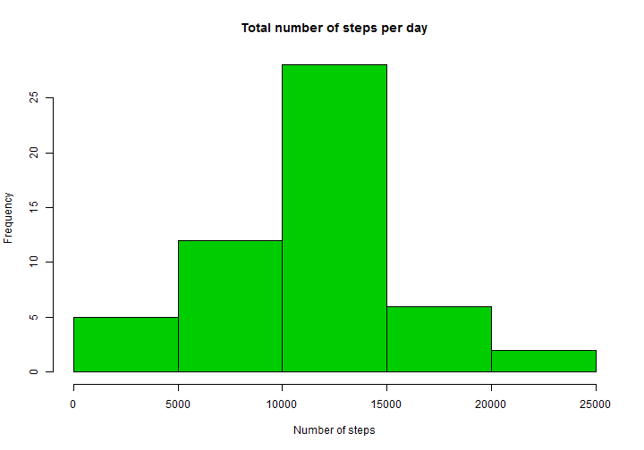
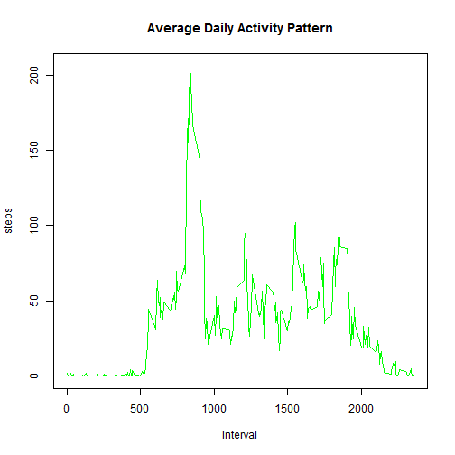

Project 1 for Reproducible Research Course
==========================================

## Load the activity data

The data is read in from the activity.csv file.


```r
library(knitr, ggplot2)
activityData <- read.csv("activity.csv")
# Show portion of data.
str(activityData)
```

```
## 'data.frame':	17568 obs. of  3 variables:
##  $ steps   : int  NA NA NA NA NA NA NA NA NA NA ...
##  $ date    : Factor w/ 61 levels "2012-10-01","2012-10-02",..: 1 1 1 1 1 1 1 1 1 1 ...
##  $ interval: int  0 5 10 15 20 25 30 35 40 45 ...
```


## What are the total number of steps taken per day?

There are 3 things we need to do:

1. Aggregate then sum by date.
2. Visulaize data in a histogram. 
3. Show the mean and median values.


```r
totalstepsbyDay <- aggregate(steps ~ date, data = activityData, sum, na.rm = TRUE)  
```


```r
hist(totalstepsbyDay$steps, col = 3, main = "Total number of steps per day", 
     xlab = "Number of steps")
```

 


```r
meanVar <- mean(totalstepsbyDay$steps, na.rm = TRUE)
medianVar <- median(totalstepsbyDay$steps, na.rm = TRUE)
```

#### The mean steps by day is 1.0766189 &times; 10<sup>4</sup>

#### The median steps by day is 10765.

## What is the average daily activity pattern?

For this question we need to make a time series plot of the 5-minute interval 
along the x-axis and the average number of steps taken, averaged across all days
along the y-axis.


```r
stepInterval <- aggregate(steps ~ interval, data = activityData, mean, na.rm = TRUE)
plot(steps ~ interval, data = stepInterval, type = "l", col = "green",
main = "Average Daily Activity Pattern")
```

 

## Which 5-minute interval contains the maximum number of steps?

This is based on the average across all days


```r
myInt <- stepInterval[which.max(stepInterval$steps), 1]
```
#### 835 is the interval that contains the max number of steps.


## Imputing missing values

There are 4 things to produce for this question:

1. Calculate and report the total number of missing values "na's" in the dataset
2. Devise high-level Strategy for "filling" missing values.
3. Create new data by filling the the original dataset's missing values
4. Create histogram of new dataset use this new dataset and histogram to:

        A. Show number of steps taken by day
        B. Calculate mean and median
        C. Compare to original dataset and histogram from part 1
        D. Describe any impact of filling in missing values.


```r
countNA <- sum(is.na(activityData$steps))
```
#### The number of missing values is 2304

#### Strategy for missing NAs: 

I plan to use the mean number of steps to fill the missing NAs.


```r
print("Place holder for fill missing values code")
```

```
## [1] "Place holder for fill missing values code"
```


```r
print("Place holder for comparing old and new dataset code")
```

```
## [1] "Place holder for comparing old and new dataset code"
```


```r
print("Place holder for describing impact code")
```

```
## [1] "Place holder for describing impact code"
```
